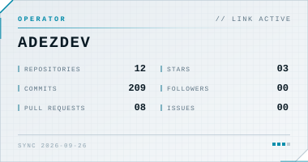
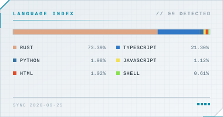

# adez

Vibe coder. I rebuild closed-source software as open source, from scratch.

### About

Dropped out a year into computer science to go all in on AI/ML, learning project by project. I take things apart to see how they work, then build my own version instead of trusting someone else's black box. Particular about details — if something's sloppy I'll notice, and fix it before calling it done.

### Projects

**[secure_mesh](https://github.com/adezdev/secure_mesh)** — *building* 
Encrypted peer-to-peer overlay in Rust, from scratch. No libp2p, no TLS, no servers. 
A node's address *is* its X25519 public key. Hand-rolled Noise IK, verified 
byte-for-byte against an independent implementation. Not audited.

**[elligator2](https://github.com/adezdev/elligator2)** — *shipped · [crates.io](https://crates.io/crates/elligator2)* 
Makes X25519 public keys indistinguishable from random bytes, so a protocol can't be 
fingerprinted by its own handshake. Verified field arithmetic, `no_std`.

**[fflags-tracker](https://github.com/adezdev/fflags-tracker)** — *maintained* 
Local-first Roblox FastFlag tracker. Browse, diff, and get notified when flags change, 
across 13 platforms. TypeScript, Next.js, SQLite. Self-hosted, MIT.

### Stack

### Stats

<picture>
  <source media="(prefers-color-scheme: dark)" srcset="profile/stats-dark.svg">
  
</picture>
<picture>
  <source media="(prefers-color-scheme: dark)" srcset="profile/langs-dark.svg">
  
</picture>

